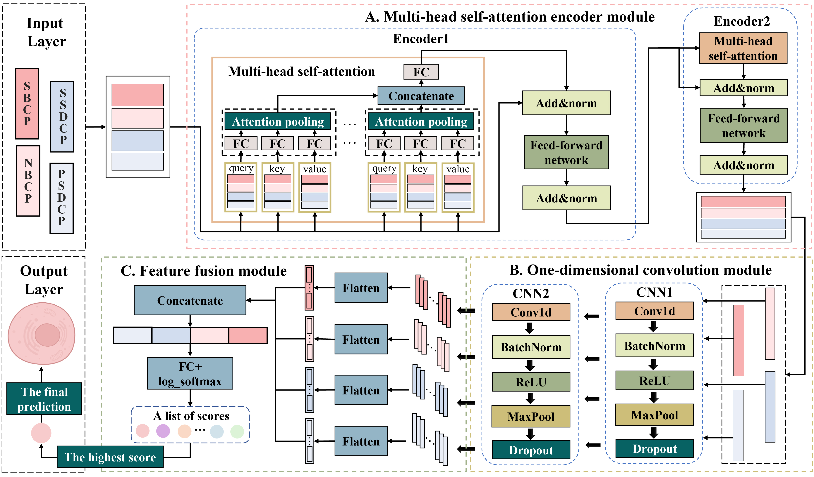

# scHiClassifier
A Deep Learning Framework for Cell Type Prediction Fusing of Multi-angle Feature Sets from Single-cell Hi-C Data  

## The framework of scHiClassifier

## The architecture of the fusion prediction model.

## Overview
The folder "**Figure**" contains the framework figure of scHiClassifier and the architecture figure of the fusion prediction model.  
The folder "**4DN**" contains the data and code details for the 4DN dataset.  
The folder "**Collombet**" contains the data and code details for the Collombet dataset.  
The folder "**Flyamer**" contains the data and code details for the Flyamer dataset.  
The folder "**Lee**" contains the data and code details for the Lee dataset.  
The folder "**Nagano**" contains the data and code details for the Nagano dataset.  
The folder "**Ramani**" contains the data and code details for the Ramani dataset.  

## Tools
It is recommended to deploy and run this project using PyCharm
We have also built an executable compute capsule for our code on the cloud-based platform Code Ocean, accessible at https://codeocean.com/capsule/2365852/tree.

## Dependency
Mainly used libraries:  
Python 3.9.15 
torch  1.13.0  
torchvision 0.14.0  
sklearn  
numpy   
See "**requirements.txt"** for all detailed libraries.  
Other developers can use the following command to install the dependencies contained in "**requirements.txt"**:
`pip install -r requirements.txt`  
